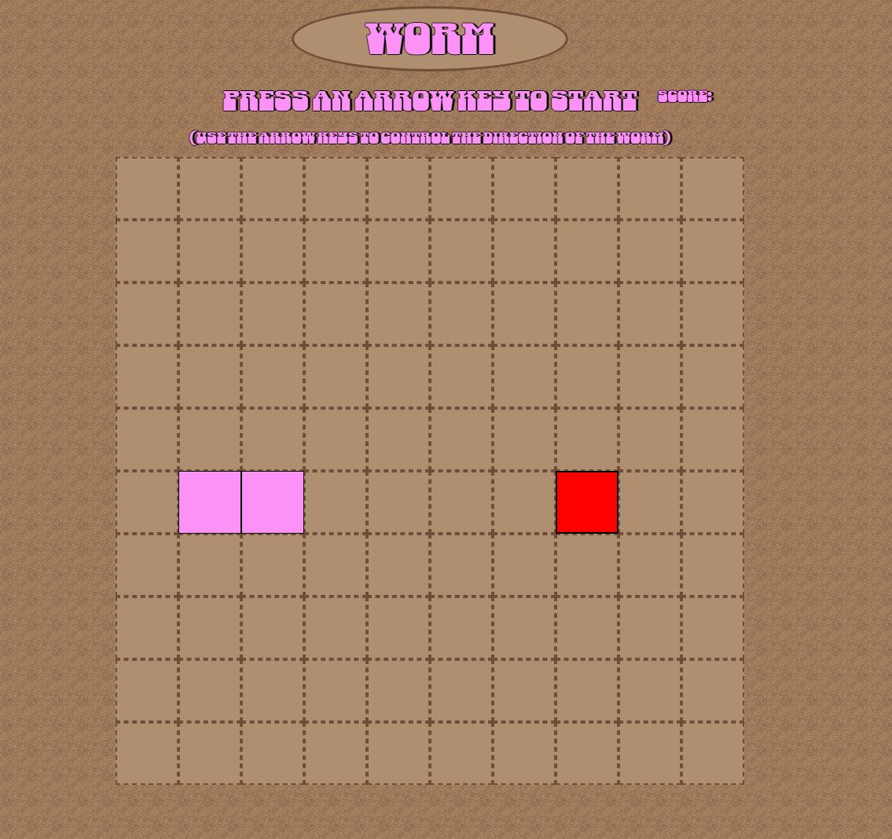

# Worm Game written in Javascript

## A snake clone that uses a worm in the dirt instead of a snake. I chose to make this game because I used to play it in school, and wanted to challenge my coding abilities.

**Getting Started:** 


* **const**: const should be used whenever a function expression is assigned to a variable.
* **The function name**: The name you choose for the function.
* **Parameters**: Optional comma separated parameters. This is the data passed into the function. If there are no parameters, the () is still required.
* **The arrow syntax**: Indicates that this will be a function.
* **The body**: The statements that make up the function itself. Surrounded by curly braces.

Example:
```
const greet = (name) => {
  console.log("Hello, " + name + "!");
}
```

. 

2. Calling a function

To execute the function, you *call* or *invoke* it by using its name followed by parentheses.

Example:
```
greet('Alice'); // Outputs: Hello, Alice!
```
3. Return values

Functions can process data input and output a value using the return keyword.

Example: 
```
const addNums = (numA, numB) => {
  return numA + numB
}

const total = addNums(2, 4);

console.log(total) // Expected value: 6
```
For more information on functions and how they are used in JS, check out the MDN docs. 
